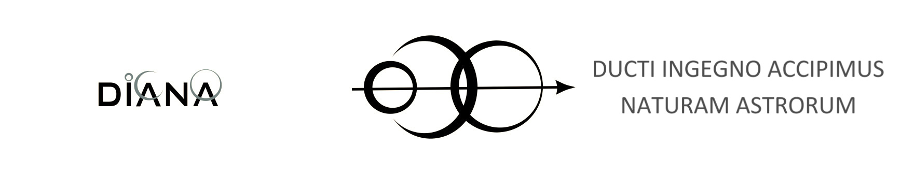

# Team Diana Wiki 

## Abous us

Born in 2008 in Polytechnic University of Turin, Team D.I.A.N.A. is a students’ team that works in the field of robotics for space application and participates in international competitions.
The name D.I.A.N.A. stands for Ducti Ingenio Accipimus Naturam Astrorum.
Professor Giancarlo Genta is the academic advisor of the Team.
The team works in collaboration with the DIMEAS (Mechanical and Aerospace) and DET (Electronics and Telecommunications) departments of the Polytechnic University.
Professors and researchers give their educational and technical support to Team D.I.A.N.A.
Team members attend different curricula of the university, allowing the division of the team in the departments of mechanical, electronics, mechatronics, aerospace, automotive, computer science, design, telecommunications, engineering management and cinema and media engineering.

From 2008 the team has constructed two main projects: Amalia, designed for lunar exploration, and more recently T0R0, constructed for ERC European Rover Competition, to which it will participate in September 2018 as an engineering model of Martian rover.

> “It’s human nature to stretch, to go, to see, to understand. Exploration is not a choice, really; it’s an imperative.” – Michael Collins

## About this wiki 

This is the wiki of the [Team Diana](http://teamdiana.it/) student team. Here you can find tutorials, guides and tips about the software that we use. 
For information about the team and news check out one of our channels:

## Contacts

[Official team website](http://teamdiana.it/)

[Facebook](https://www.facebook.com/teamdiana/)

---
